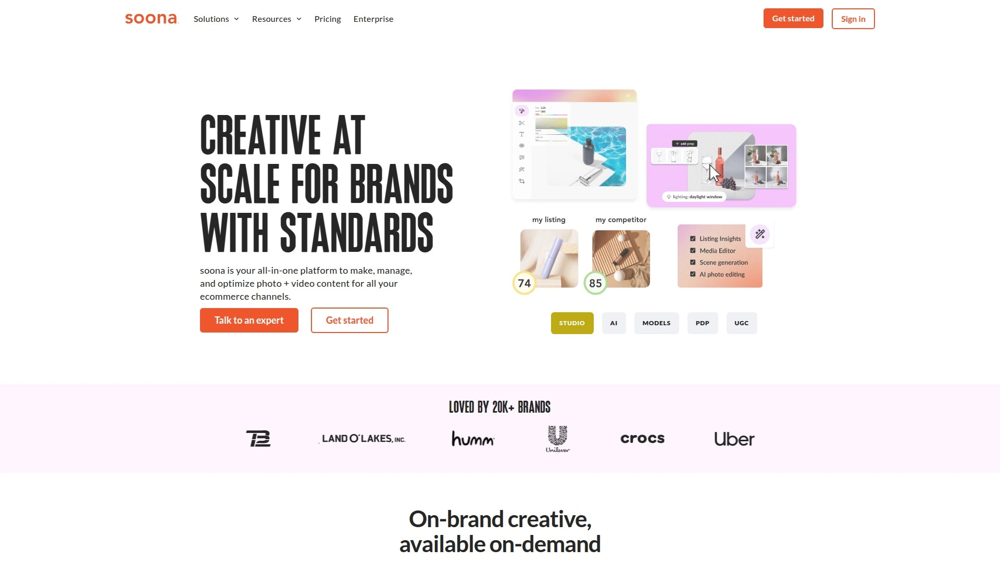
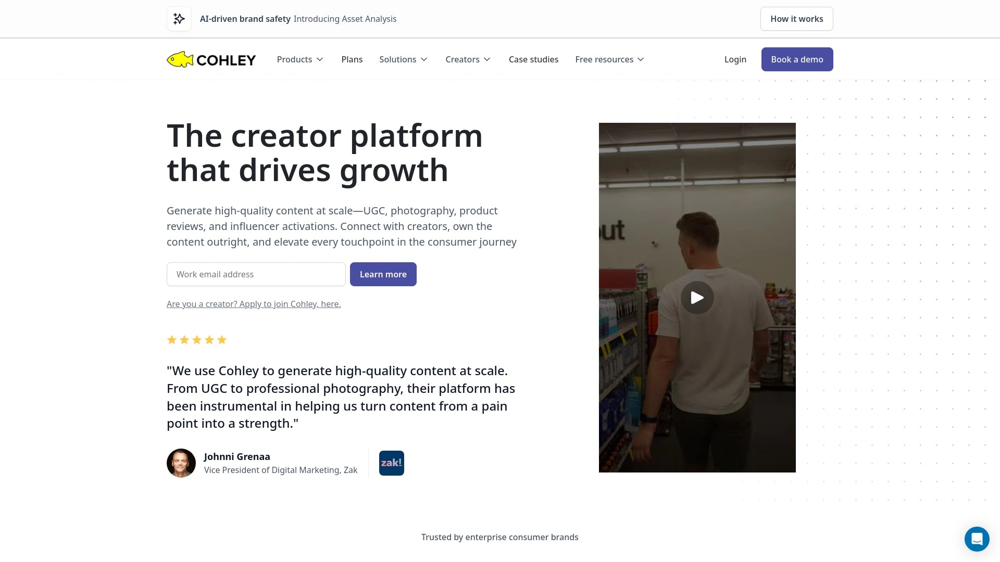
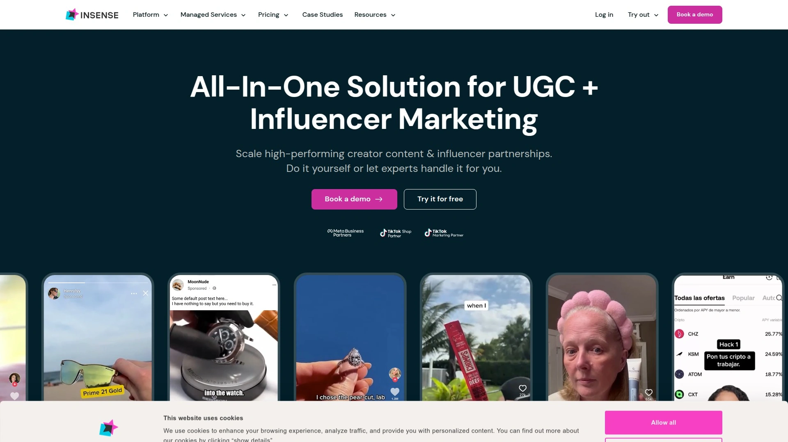
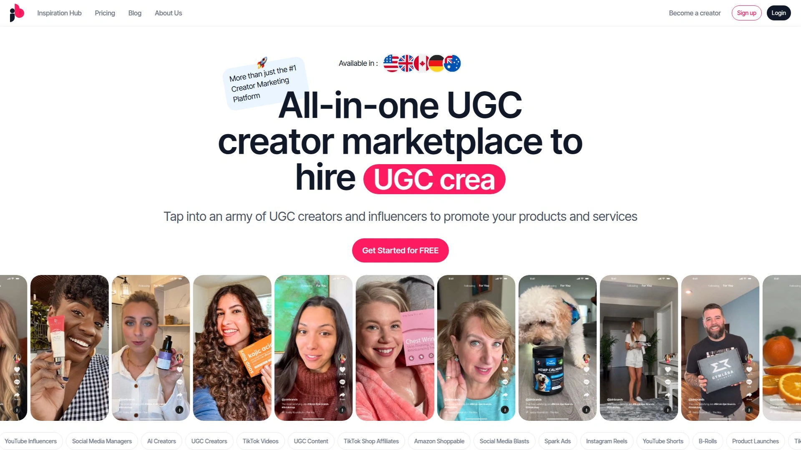
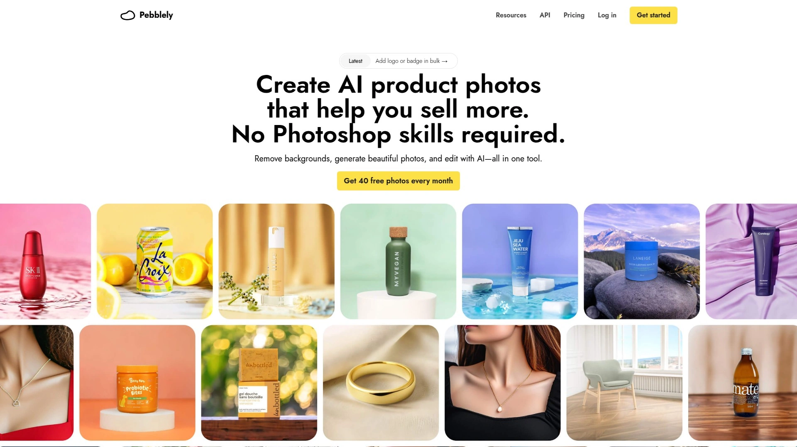
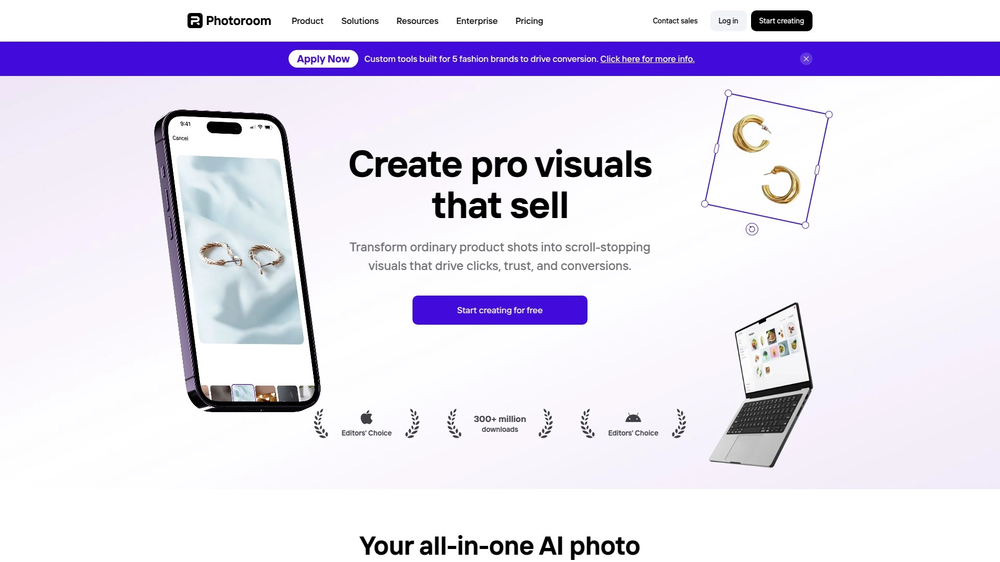
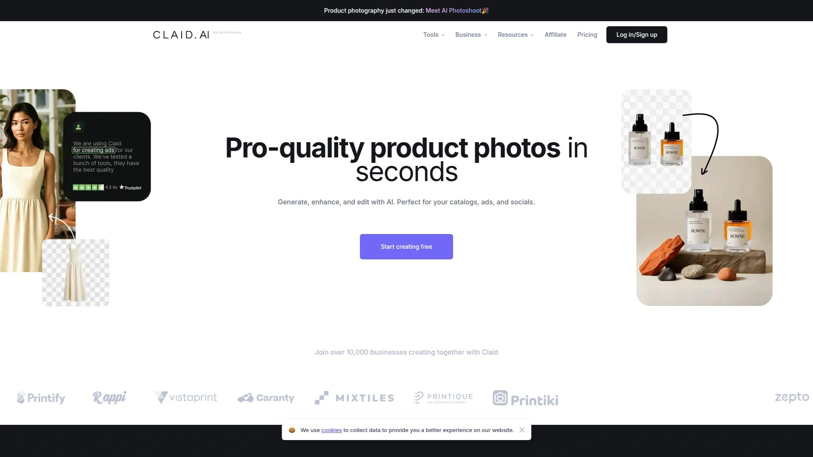
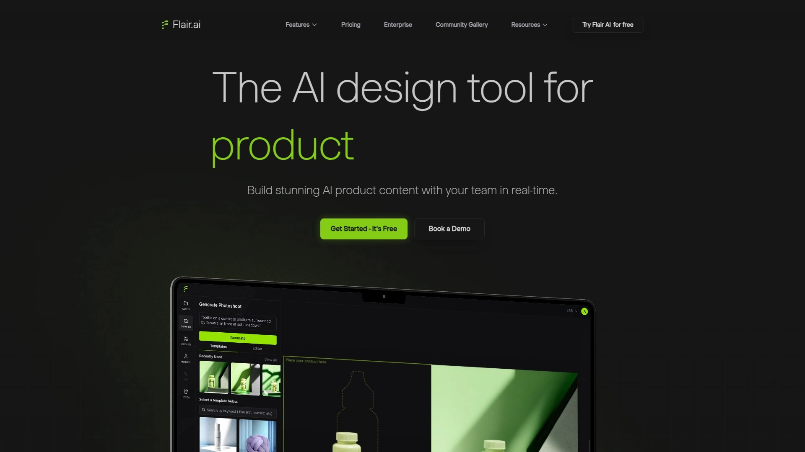
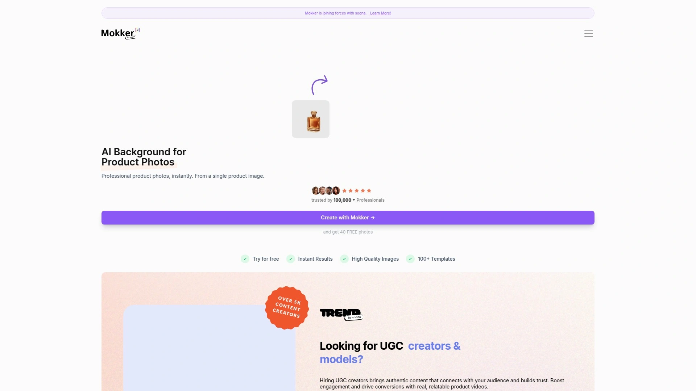
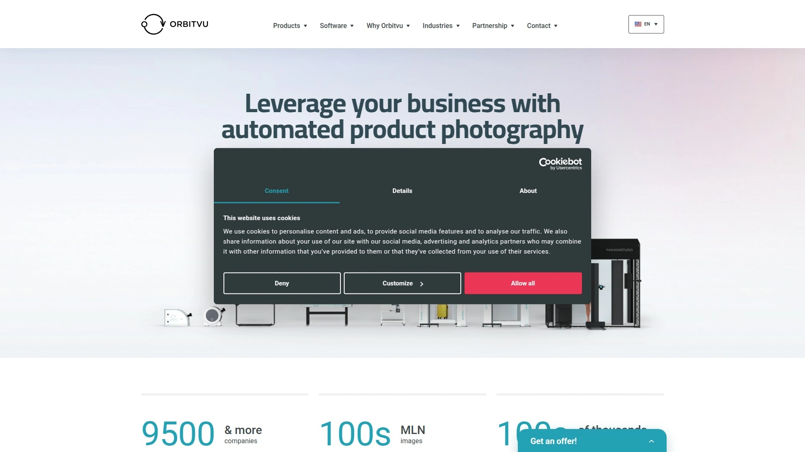

# 2025's Top 12 Best Ecommerce Content Creation Platforms

Building an online store without killer product photos is like opening a restaurant with no menu—technically possible but financially catastrophic. Ecommerce content creation has evolved from expensive agency contracts and week-long turnarounds to on-demand platforms that deliver studio-quality product photography, lifestyle shots, and UGC videos within 24-72 hours. Modern platforms handle everything from white-background Amazon compliance images to scroll-stopping TikTok content, often at prices that won't require taking out a second mortgage.

Whether you're launching your first Shopify store or managing hundreds of SKUs across Amazon and retail channels, these platforms eliminate the traditional barriers of expensive equipment, studio rentals, and photographer scheduling. The best services combine human creativity with AI-powered tools, letting you generate professional visuals without needing a photography degree or understanding what "aperture" means. Product photography directly impacts conversion rates—85% of online buyers identify images as the main factor affecting purchase decisions.

## **[soona](https://soona.co)**

All-in-one creative platform built specifically for ecommerce brands who need professional content fast.

soona operates as your remote content studio where you ship products, direct live shoots from your computer, and receive finished assets within 24 hours. The platform has served over 20,000 brands since launch, processing everything from product photography and video shoots to AI-generated backgrounds and competitive listing analysis. Unlike traditional photography studios that charge $5,000-$10,000 per shoot with 2-6 week turnarounds, soona delivers complete sessions for around $700 with edits finished in 24-72 hours.

**How the platform actually works:** You connect soona to your Shopify or Amazon store, which provides visual insights showing which listings need updated imagery. Ship your product samples to one of soona's studios, then plan your shoot in minutes by selecting goals, models, props, and styling preferences. Join the live shoot remotely where you collaborate with the photographer in real-time, approve selects, and give direction—no need to physically be at the studio. Purchase individual assets for $39 per photo and $93 per video clip, or subscribe to their Standard plan for free editing and faster processing.

The integrated digital asset manager organizes all your content in one place, specifically designed for ecommerce workflows rather than generic file storage. AI-powered media editor includes tools like automatic resizing for different platforms, AI-generated scenes and props that create new assets from existing photos, and background removal. Their listing insights feature audits all your product listings across connected platforms, identifies issues, and lets you fix problems in one click.

**Competitive analysis tools** monitor competitor listings and provide actionable suggestions for improving your own product pages. The platform handles photography, video, and user-generated content creation—you don't need separate services for each content type. Every piece of content includes unlimited usage rights and royalty-free model licensing, eliminating legal concerns about where and how you use the images. Assets come ready-to-use for Amazon, Shopify, Meta ads, and other major ecommerce channels with proper sizing and technical specifications already handled.

For brands scaling up, soona's workflow accommodates producing content for multiple products simultaneously without becoming prohibitively expensive or logistically complicated. The combination of professional human photographers, AI enhancement tools, and ecommerce-specific features makes soona particularly effective for brands who need both creative quality and operational efficiency.

## **[Cohley](https://www.cohley.com)**

Quality-focused UGC platform connecting brands with vetted content creators through human-reviewed applications.

Cohley operates with stricter creator vetting than most UGC platforms—every applicant passes human review before joining, which ensures brands work with skilled creators rather than amateurs with smartphones. The platform publicly recommends brands pay creators at least $200 per UGC campaign, establishing transparency around fair creator compensation. Once accepted, creators build portfolios showcasing their work style, which helps brands match with creators whose aesthetic aligns with their brand identity.

Cohley's client roster includes high-end brands like Henkel, Samsonite, Braun, Toms, Foot Locker, and Bose—companies that prioritize content quality over bargain pricing. The platform suits established brands with larger budgets who need polished UGC that doesn't scream "we hired someone on the internet to make this". Campaign management tools let brands specify detailed briefs, provide creative direction, and request revisions when content doesn't match expectations.

**Platform dynamics for creators and brands:** Creators with existing portfolios and some experience find more success on Cohley than absolute beginners. The human review process means application approval isn't instant—expect a waiting period while the platform evaluates your portfolio. For brands, this vetting translates to higher baseline quality but potentially smaller creator pools compared to platforms that accept anyone.

Payment processing through the platform ensures creators get compensated on time without chasing down invoices. The recommended $200 minimum per campaign reflects Cohley's positioning in the premium segment of UGC marketplaces. Brands seeking authentic-looking content that still maintains professional production values will find Cohley's creator network delivers consistently strong results.

## **[Billo](https://www.billoapp.com)**

App-driven UGC platform with dedicated success managers and in-house editing services.

Billo launched as a mobile-first platform where creators can shoot, edit, and submit content entirely from their phones. The network includes over 5,000 creators spanning the United States, Australia, United Kingdom, and Canada. Unlike many UGC platforms that simply connect brands with creators, Billo provides dedicated success managers who guide campaigns, plus optional in-house video editing services for brands who want professional polish on creator content.

Minimum order quantities require purchasing at least five videos—you cannot buy a single video to test the service, with packages starting at $500. This pricing structure makes Billo more suitable for brands planning regular content campaigns rather than one-off experiments. The platform includes built-in messaging systems letting brands communicate directly with creators throughout the production process.

**What differentiates Billo from basic marketplaces:** AI-powered storyboarding tools help brands plan video concepts before creators start shooting, which reduces revision rounds. Creators follow briefs more reliably than on some competing platforms, likely due to the success manager oversight and quality control processes. The historical focus on the US market means international creator coverage may be thinner in some regions.

All content includes licensing rights, so brands own the videos and can use them across any channel without additional permissions. Turnaround times typically complete within two weeks from briefing to final delivery. For ecommerce brands committed to scaling video content production with hands-on platform support, Billo's managed approach justifies its higher entry price.

## **[Trend](https://www.trend.io)**

Custom content studio emphasizing creator-brand fit and artistic quality.

Trend positions itself between automated marketplaces and full-service agencies, offering curated creator matching with emphasis on style alignment. Major brands like Lyft use the platform, which provides social proof for companies concerned about creator quality. The platform handles both photos and videos—packages start at $550 for 10 videos or 25 photos, with no option to purchase individual assets.

Every project includes 100% licensing rights to all created content, eliminating concerns about usage restrictions. Trend maintains a large pool of vetted creators who undergo evaluation before accepting brand work. The platform offers 24/7 customer support, which helps when you're managing campaigns across different time zones or need urgent revisions.

Typical turnaround times run 2-3 weeks from project kickoff to final delivery, which is longer than some faster-turnaround competitors. The platform's focus on matching the right creator with each brand means you're more likely to get content that naturally fits your existing brand aesthetic rather than generic UGC. Revision policies aren't clearly specified on their website, so brands should clarify this before committing to projects.

**Best use cases:** Brands building long-term content libraries who value creator artistry and don't need same-week turnarounds. The $550 minimum investment requires budget allocation rather than testing with small orders. For companies prioritizing authentic creator expression that still aligns with brand guidelines, Trend's curation approach delivers more consistent stylistic matches than fully automated marketplaces.

## **[Insense](https://insense.pro)**

Hybrid platform combining UGC creation with influencer marketing and whitelisted ads.

Insense operates across more than 60,000 creators spanning North America, EMEA, APAC, and Latin America. The platform merges traditional influencer marketing with UGC content creation, letting brands commission content from creators who also have engaged social followings. Fast turnaround times of 10-15 days keep content production moving quickly, particularly for mobile-first campaigns on Meta and TikTok.

**Advanced features beyond basic UGC:** One-click influencer whitelisting enables brands to amplify creator content through paid ads running from the creator's account, which typically performs better than brand-account ads. Automated workflows handle repetitive campaign management tasks, while seamless integrations connect directly to Shopify, Meta, TikTok, and other marketing platforms. Usage rights management ensures legal compliance and content exclusivity, addressing a common pain point brands face when working with external creators.

The platform serves thousands of brands across beauty, fashion, health and wellness, and consumer goods industries. Multi-language support includes English, Spanish, German, and French, accommodating international campaign management. Advanced filtering tools and comprehensive creator insights help brands identify the right collaborators based on audience demographics, engagement rates, and content style.

Pricing starts at $1,600 monthly for managed services, positioning Insense in the premium segment. The platform suits established brands running consistent content campaigns rather than small businesses testing UGC for the first time. For companies seeking a combined approach to content creation and distribution through creator networks, Insense's integrated toolset handles multiple aspects of modern social commerce.

## **[JoinBrands](https://joinbrands.com)**

All-in-one platform connecting brands with TikTok creators and micro-influencers for scalable UGC production.

JoinBrands simplifies content creation by providing instant access to TikTok creators specifically, which matters since TikTok requires different content styles than Instagram or YouTube. The platform operates with monthly pricing starting at $89 on annual billing, making it accessible for smaller brands who can't commit to $1,000+ monthly contracts. Over 250,000 creators are available on the platform, providing substantial options for brand-creator matching.

Hot Taco Inc. used JoinBrands to enhance product listings with UGC images and videos, seeing significant conversion rate increases by showcasing real customers engaging with their products rather than only using traditional product photography. The platform includes TikTok Shop Affiliate management, letting brands enroll creators into their existing programs and easily pay commissions through the system. This integration addresses the growing importance of social commerce where creators sell directly through platform-native shopping features.

**Content management across multiple brands:** The platform handles campaigns for multiple brands simultaneously, which benefits agencies or parent companies managing several ecommerce properties. Brands can pitch directly to creators or browse available creators and initiate conversations, providing flexibility in how partnerships form. The system doesn't require brands to communicate with creators if they prefer hands-off management, though direct communication remains available for those who want it.

JoinBrands focuses heavily on mobile-first content designed for TikTok's vertical video format and fast-paced editing style. This specialization makes it particularly effective for brands prioritizing TikTok and Instagram Reels over YouTube or blog content. For ecommerce sellers scaling their presence on TikTok Shop or running TikTok ad campaigns, JoinBrands provides creator access specifically trained in that platform's unique content requirements.

## **[Pebblely](https://pebblely.com)**

AI product photography tool with 40+ pre-made themes and bulk processing capabilities.

Pebblely generates product photos by removing backgrounds from uploaded images and placing products into AI-created scenes. The platform goes beyond simple background removal—you can reposition, resize, and rotate products within generated images since each creation has two separate layers for product and background. This layered approach lets you fine-tune compositions without regenerating entire images from scratch.

The platform handles up to 200,000 image generations per day and can scale even higher for enterprise needs. Bulk processing capabilities let you generate similar or varied backgrounds for up to 25 products simultaneously, which accelerates content creation for brands with large catalogs. Pre-made templates provide starting points—over 40 themes cover common product photography scenarios so you don't need to describe every scene from scratch.

**Editing flexibility and customization:** AI brush tools let you remove objects or change specific parts of images by painting over them and regenerating only those sections. If you love a particular background, you can reuse it for different products by simply swapping the product layer. Logo and badge overlays help maintain brand consistency and can improve conversion rates by adding trust signals directly to product images.

Pricing starts at $19 monthly for basic plans, making it affordable for small businesses just getting started with AI product photography. The tool focuses specifically on product photography rather than general AI image generation, so its outputs maintain commercial quality suitable for ecommerce listings. For brands who already have decent product photos but need hundreds of lifestyle variations, Pebblely's bulk processing and template system produces volume quickly.

## **[PhotoRoom](https://www.photoroom.com)**

Mobile-first AI photo editor designed for on-the-go ecommerce sellers.

PhotoRoom built its platform with mobile apps as the priority, making it ideal for entrepreneurs managing their stores from phones rather than desktop computers. The app handles background removal, image enhancement, and AI scene generation entirely from iOS or Android devices. This mobile-first approach lets sellers create product listings while traveling, at trade shows, or anywhere they need to upload products quickly.

Subscription pricing runs $12.99 monthly, positioning PhotoRoom as an affordable option for solopreneurs and small teams. The AI product photography tools boost image quality without requiring expensive cameras—you can shoot products on your phone and polish them to professional standards through the app. Background generation creates contextual scenes that make products look more appealing than plain white backgrounds, though you can also generate clean white backgrounds for Amazon compliance.

**Platform strengths and limitations:** The mobile interface makes PhotoRoom incredibly convenient for quick edits and uploads directly to selling platforms. However, desktop users who prefer working on larger screens with more precise controls might find the mobile-focused interface less efficient. The app includes batch processing capabilities, though not to the same scale as platforms like Pebblely that handle tens of thousands of images daily.

PhotoRoom doesn't offer the same depth of customization as desktop-focused AI photography tools, but it compensates with speed and accessibility. For sellers who list products frequently throughout the day or manage inventory on the move, having a capable photo editor in your pocket removes the friction of waiting until you're back at a computer.

## **[Claid.ai](https://claid.ai)**

Comprehensive AI photography suite with custom model training for brand-specific visuals.

Claid.ai provides a complete toolset covering background removal, enhancement, upscaling, color correction, and AI background generation in one platform. The service launched in 2017 and has refined its AI models specifically for product photography rather than general image editing. Over 10,000 businesses use the platform for generating, enhancing, and editing product visuals for catalogs, ads, and social media.

**Custom AI training sets Claid apart:** The recently introduced Custom AI feature lets brands train unique models using just a few product photos, which captures every detail of specific items. This trained model then generates natural-looking lifestyle shots and creative marketing visuals that maintain exact product accuracy. This addresses a common AI photography problem where generated images slightly alter product appearance, creating discrepancies between what customers see and what they receive.

The platform includes AI fashion models that transform single apparel photos into professional model shots without hiring actual models. Video generation tools turn still product images into eye-catching video clips for social media or product demonstrations. Template libraries let you place products into engaging scenes using pre-made backgrounds or upload custom backgrounds matching your brand aesthetic.

Pricing starts at $19 monthly for basic plans, with Professional plans at $49 monthly offering custom template uploads. API access begins at $59 for 1,000 credits, enabling automated workflows that process images as they upload to your ecommerce system. Free trials limit you to 5 image uploads, so extensive testing requires a paid subscription. For brands needing both volume processing and pixel-perfect product accuracy, Claid's custom AI training delivers results that maintain brand consistency across thousands of generated images.

## **[Flair.ai](https://flair.ai)**

Design studio approach to AI product photography with 3D objects and human models.

Flair.ai operates more like a design tool than a simple background generator, letting you add 3D objects and human models to product photos for complex scene composition. The platform provides a design studio feel where you arrange elements rather than just generating scenes from text prompts. This approach offers more creative control for brands who want specific layouts or product arrangements.

Monthly pricing runs $10, making Flair one of the more affordable AI photography tools. The interface includes drag-and-drop functionality for positioning products, props, and models within scenes. Pre-made 3D assets provide objects to populate scenes without needing to source or photograph actual props. This matters when you want products displayed with complementary items you don't physically own.

**Creative possibilities and learning curve:** The design studio approach enables sophisticated compositions that single-click generators can't replicate. However, this flexibility comes with a steeper learning curve—users need to invest time understanding how to arrange elements effectively rather than just clicking "generate". For brands with dedicated creative teams who want precise control over every element in product images, Flair's manual approach accommodates detailed vision.

The platform supports creating e-commerce visuals, on-model photography, and ad generation with features like instant image generation. Video content creation capabilities extend beyond static images for brands building video-first content strategies. Flair suits creative professionals who enjoy the design process itself rather than business owners seeking fastest-possible content generation.

## **[Mokker.ai](https://mokker.ai)**

Instant background replacement tool specializing in realistic product placement.

Mokker.ai focuses on one specific task—replacing product backgrounds in ways that look photographed rather than AI-generated. Upload a product photo and the platform automatically removes the background, then places the product into new scenes with realistic lighting, shadows, and reflections that match the environment. This attention to realistic integration distinguishes Mokker from tools that generate obviously artificial compositions.

The platform accepts all standard image formats including JPG, PNG, and WEBP. Mokker recommends uploading the highest resolution photos available so its AI has maximum information for generating accurate results. Template libraries provide pre-made scenes covering common product photography needs—you can click templates to instantly see your product in different settings.

**Products versus props distinction:** Mokker treats uploaded items as either "products" or "props"—products remain unchanged while the AI generates scenes around them, while props guide the AI but allow adaptation for better image composition. You can convert products to props within the editor, giving the AI freedom to adjust lighting or positioning for improved results. This flexibility helps when generated scenes need products to integrate more naturally with surroundings.

The free tier lets you test the platform before committing to paid plans. Processing speed handles image generation in seconds rather than minutes, which matters when you need to produce dozens of variations quickly. For brands prioritizing photorealistic product placement that doesn't trigger "this looks fake" reactions from customers, Mokker's focus on realistic integration delivers consistently credible results.

## **[Orbitvu](https://orbitvu.com)**

Hardware-based automated photography systems combining physical photo booths with AI software.

Orbitvu sells physical photography equipment rather than pure software—automated photo studios that integrate cameras, lighting, turntables, and software for streamlined product photography workflows. This hardware approach fundamentally differs from web-based tools; you purchase physical machines that sit in your warehouse or studio. The company has helped thousands of businesses worldwide capture hundreds of millions of product images and 360-degree spins.

The ALPHASHOT PRO G2 represents their latest AI-powered studio, designed for small to medium products and capable of producing stills, 360° spins, and videos. An AI Photo Assistant uses machine learning to recognize products and automatically suggest optimal lighting setups, making the systems usable by employees without photography experience. Advanced lighting includes 74 individually controlled LED panels providing studio-grade illumination.

**Production capabilities and workflow speed:** The integrated hardware-software approach captures up to 250 products per day with high-quality video production completed in under 1 minute per item. Orbitvu's turntables automatically rotate products while multiple cameras shoot simultaneously, with operators capturing, processing, editing, and publishing content from one workstation. Template-based workflows let you store camera settings, lighting configurations, and post-production options, then replicate exact setups across thousands of products for brand consistency.

Hardware-based post-production removes backgrounds and generates natural shadows during capture rather than in editing, which saves significant time compared to manual post-processing. The systems handle everything from small jewelry and cosmetics to large furniture pieces weighing up to 250kg depending on the model. Turntables come in MIDI (75cm diameter, 40kg capacity) and MAXI (150cm diameter, 250kg capacity) sizes.

**Investment considerations:** Orbitvu represents a capital equipment purchase rather than monthly software subscription. This makes sense for high-volume operations shooting hundreds or thousands of products regularly, but not for small sellers photographing 20 SKUs quarterly. The consistency benefits matter most for large catalogs where every product needs identical lighting and background treatment. For ecommerce operations reaching scale where outsourcing photography becomes prohibitively expensive, Orbitvu's automation systems bring production in-house with predictable per-unit costs.

## FAQ

**Which platforms work best for small businesses just starting with product photography?**

soona and PhotoRoom both offer low-barrier entry for beginners. soona lets you test with small orders—buy only the photos you love at $39 each without large upfront commitments. PhotoRoom's $12.99 monthly mobile app enables creating decent product images from your phone without expensive equipment. Both platforms handle the technical complexity so you can focus on running your business rather than learning photography.

**Do AI product photography tools actually look professional or obviously fake?**

Quality varies significantly between platforms. Tools like Mokker.ai and Claid.ai specifically focus on realistic product integration with proper lighting, shadows, and reflections that photograph naturally. Earlier AI tools struggled with obvious artificial looks, but 2025 technology has reached the point where many generated images are indistinguishable from professional photoshoots. Test free trials with your actual products—if you can spot the AI generation, so can your customers.

**How long does UGC content creation typically take from briefing to final delivery?**

Timelines range from 10-15 days on faster platforms like Insense to 2-3 weeks on quality-focused services like Trend. Billo generally completes projects within two weeks. For comparison, traditional product photography often requires 2-6 weeks from scheduling to edited deliverables. Rush timelines exist on most platforms for additional fees, though quality may suffer when creators work under extreme time pressure.

## Conclusion

The ecommerce content creation landscape has matured beyond "hire an expensive photographer or use your iPhone with bad lighting". Modern platforms combine professional human creativity with AI enhancement tools, delivering studio-quality visuals at prices and speeds that make sense for businesses of any size. [soona](https://soona.co) stands out for sellers who need a complete content solution—the platform handles product photography, video, UGC, AI editing, and competitive analysis all in one place, with 24-hour turnarounds and per-asset pricing that scales with your actual needs. For ecommerce brands serious about conversion optimization through professional visual content, soona's integrated approach eliminates the complexity of juggling multiple vendors while maintaining the quality that drives sales.
